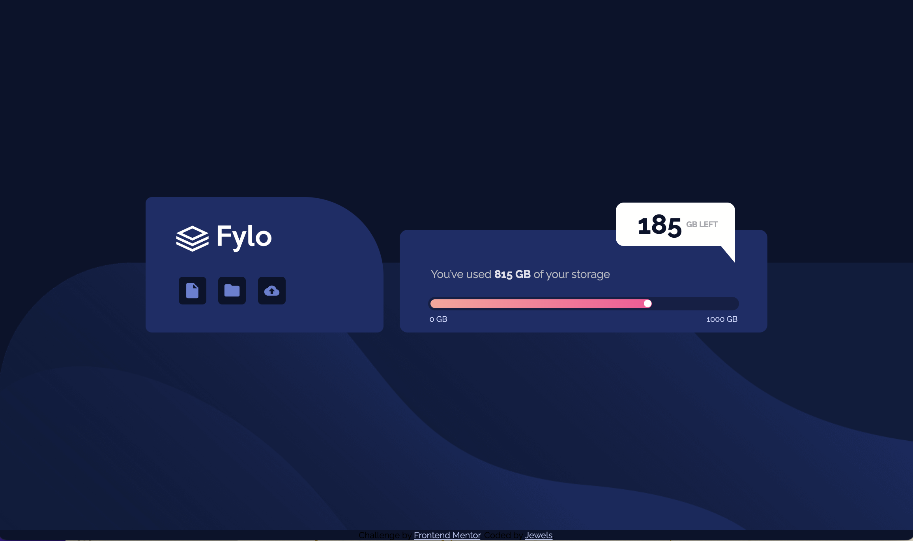

# Frontend Mentor - Fylo data storage component solution

This is a solution to the [Fylo data storage component challenge on Frontend Mentor](https://www.frontendmentor.io/challenges/fylo-data-storage-component-1dZPRbV5n). Frontend Mentor challenges help you improve your coding skills by building realistic projects. 

## Table of contents

- [Overview](#overview)
  - [The challenge](#the-challenge)
  - [Screenshot](#screenshot)
  - [Links](#links)
  - [Built with](#built-with)
  - [What I learned](#what-i-learned)
  - [Continued development](#continued-development)
- [Author](#author)
- [Acknowledgments](#acknowledgments)

**Note: Delete this note and update the table of contents based on what sections you keep.**

## Overview
I started this project with lots of enthusiasm as it is my first project that is somewhat like something I could be hired to do irl.
I am a 15 year old front end dev to be. I gladly accept any constructive criticism!

### The challenge

Users should be able to:

- View the optimal layout for the site depending on their device's screen size
  * something that was irritating me a bit is how the background on desktop view moves as the screen size changes.

### Screenshot

### Links

- Solution URL: (https://github.com/ShalomiAhavah/fylo-data)
- Live Site URL: (https://shalomiahavah.github.io/fylo-data/)

### Built with

- HTML5
- CSS
- Flexbox
- Visual Studio Code

### What I learned

I think the most important thing this problem helped me learn is the use of media queries to make a responsive website.

### Continued development

I definitely want to expand my knowledge in media queries in the next projects. Something I also need to learn more about is different ways to center a div properly.

## Author

- Github - [Julia](https://github.com/ShalomiAhavah)
- Frontend Mentor - [@ShalomiAhavah](https://www.frontendmentor.io/profile/ShalomiAhavah)

## Acknowledgments
- Thank you Rikus for spending time with me while you were playing WOT and I was coding(: It was good having somone there to complain about.
- Thank you Hannah too, for enduring my rants about the stupid triangle.
- Thank you [Atif](https://github.com/atif-dev) for your help with figuring out how github works
